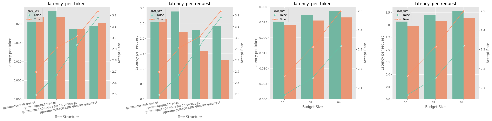

<h1> Dynasurge: Dynamic Tree Speculation for Prompt-Specific Decoding </h1>


<p align="center">

</p>
Dynasurge introduces a dynamic token tree construction algorithm optimized for prompt-specific speculative decoding, enhancing the efficiency of LLMs like Llama2-7B. It adapts the token tree structure during the drafting phase to improve speculative performance based on the complexity of the prompt. In the verification phase, an innovative enhanced tree search algorithm optimizes the acceptance rate and extends the valid speculation length. 


## Experimental Setup

### Model
Dynasurge's performance evaluations utilize the LLaMA model family. 
- **JackFram/Llama68m** for generating draft tokens
- **LLaMA2-7B** as target model

### Dataset
We conduct evaluations using two significant datasets to ensure the statistical significance and broad applicability of our results:
- **C4 (en) validation dataset**
- **CNN DailyMail dataset**

Each dataset involves testing 200 examples, with prompt and generation lengths set to 128 tokens to standardize the evaluation of different decoding strategies.

### Platform
The experiments were performed on AWS g5.4xlarge instances equipped with:
- **GPU**: NVIDIA A10
- **CPU**: 16 cores
- **RAM**: 64 GiB

### Results Reproduction
You can simply run `bash eval.sh` after set up the environmemnt.

## Env Setup
Create and activate a new environment with the required dependencies:
```bash
conda create -n dynasurge python=3.11
conda activate dynasurge

pip install -r requirements.txt
```

## Usage
Execute the project in various modes depending on your requirements.

### Autoregressive Mode
```bash
CUDA_VISIBLE_DEVICES=0 python main.py --draft JackFram/llama-68m --target huggyllama/llama-7b  --T 0.9 --P 1.0  --start 0 --end 200 --M 384 --mode auto --dataset cnn
```

### Static Tree Mode
In static tree mode, the model utilizes a predefined tree structure. Specify the growmap file using the `--growmap` option to define the tree's structure.
```bash
CUDA_VISIBLE_DEVICES=0 python main.py --draft JackFram/llama-68m --target huggyllama/llama-7b  --T 0.9 --P 1.0  --start 0 --end 200 --M 384 --mode sTree --growmap ./growmaps/4x8-tree.pt  --dataset cnn
```

### Dynamic Tree Mode
Dynamic tree mode allows for flexible tree structures adjusted by a draft token budget. Use the `--B` option to set the maximum budget for dynamic adjustments during processing.
```bash
CUDA_VISIBLE_DEVICES=0 python main.py --draft JackFram/llama-68m --target huggyllama/llama-7b  --T 0.9 --P 1.0  --start 0 --end 200 --M 384  --growmap ./growmaps/8x8-tree.pt --mode dTree --B 64 --dataset cnn
```

### Enable Enhanced Tree Verification (ETV)
The Enhanced Tree Verification (ETV) is an algorithm implemented in this project to improve tree-style speculative decoding. You can enable ETV by using the `--use_bfs` flag. For example:
```bash
# static tree mode with ETV
CUDA_VISIBLE_DEVICES=0 python main.py --draft JackFram/llama-68m --target huggyllama/llama-7b  --T 0.9 --P 1.0  --start 0 --end 200 --M 384 --mode sTree --growmap ./growmaps/4x8-tree.pt  --dataset cnn --use_bfs

# dynamic tree mode with ETV
CUDA_VISIBLE_DEVICES=0 python main.py --draft JackFram/llama-68m --target huggyllama/llama-7b  --T 0.9 --P 1.0  --start 0 --end 200 --M 384  --growmap ./growmaps/8x8-tree.pt --mode dTree --B 64 --dataset cnn --use_bfs
```

## Disclaimer

This project is developed as a demonstration for a course assignment and is currently in its prototype stage. Future developments and improvements are planned as part of ongoing research and educational efforts.
